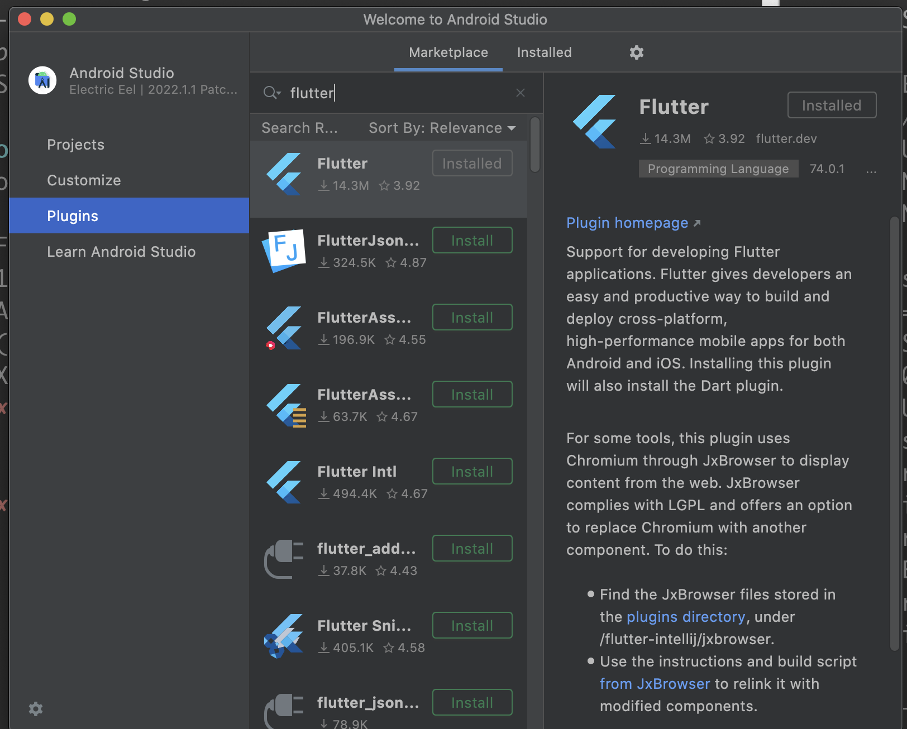

# 42Seoul flutter 세팅

## 1. flutter 설치.

https://docs.flutter.dev/get-started/install/macos

위 url에서 플러터를 $HOME/goinfre 경로에 설치(압축해제까지)해주세요.

## 2. setting.sh 스크립트를 실행하고 터미널을 종료후 실행해주세요.

flutter, dart 패키지 설치, android gradle 빌드 관련 환경변수를 설정하고 필요한 디렉토리를 생성합니다.

goinfre에 디렉토리가 잘 생성됐는지 확인하고 flutter doctor를 실행해서 환경변수가 잘 설정됐는지 확인해주세요.

## 3. Android Studio 설치

Managed Software Center에서 Android Studio를 설치해주세요.

설치가 완료되면, Android Studio를 실행합니다.

Missing SDK 화면에서 다음 화면으로 넘어가면 SDK가설치될 화면을 설정할 수 있습니다.

$HOME/goinfre/android_sdk 경로로 지정합니다.
(자유롭게 goinfre 내에 디렉토리를 만들어서 진행하셔도 됩니다.)

## 4. Android Studio Flutter Plugin 설치

Plugins 탭에서 Flutter를 검색한 후 설치 해주세요.

## 5. Android cmd-line tools 설치

안드로이드 프로젝트를 하나 생성합니다.

상단 메뉴에서 Tools > SDK Manager를 클릭합니다.

SDK Tools 탭을 선택한 후 Android SDK Command-line Tools(latest)를 체크한 후 OK 버튼을 클릭하면 설치가 진행됩니다.

## 6. Android licenses 동의하기

flutter doctor --android-licenses

위 명령어를 실행 후 모두 동의해줍니다.

그 후 flutter doctor를 실행했을 때,  Xcode를 제외하고 모두 체크된 것을 확인 해주세요.

## 7. Android Emulator 만들기

아까 만들었던 안드로이드 프로젝트를 엽니다.

Tools > Device Manager를 클릭합니다.

Device Manager 탭에서 Create Divice를 클릭합니다.

여러 기기 목록중에 밑으로 내려서 Pixel2를 선택합니다.
(다른 기기 선택해도 되지만 너무 큰 기기 선택시 맥 성능상  원활한 작업 어려울 수 있음) 

System Image에서 기본으로 선택된 R(API 30)을 설치합니다.
(R 옆에 내려받기 버튼 선택)

설치 완료되면 Next 버튼을 쭉 눌러서 생성합니다.

(오류가 발생하면서 생성이 안되면 $HOME/.gradle 디렉토리를 삭제하고 진행합니다)

디바이스가 생성됐다면, $HOME/.android/avd/ 경로를 확인합니다.

디바이스이름.avd 디렉토리를 goinfre 디렉토리로 옮깁니다.

mv Pixel_2_API_30.avd $HOME/goinfre

그 후 .ini 파일을 열고 path를 아까 변경한 경로(Users/IntraName/goinfre/디바이스.avd)로 바꿔줍니다.

경로를 절대경로로 정확히 적어주세요.

Android Studio에서 생성한 디바이스를 실행해봅니다.

